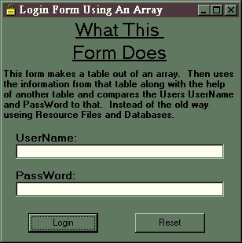



## The \*Array Login\* Method

### Description

There's a whole lot of examples on Login forms on Planet Source Code. But half of them are garbage and don't work. And the others are generic and use everyday resource files, and databases. My project uses Arrays to make tables, and uses those arrays as the database intstead of useing up disk space.
 
### More Info
 

             |
---                |---
**Submitted On**   |2000-08-10 10:43:48
**By**             |[Alwee](https://github.com/Planet-Source-Code/PSCIndex/blob/master/ByAuthor/alwee.md)
**Level**          |Intermediate
**User Rating**    |4.9 (34 globes from 7 users)
**Compatibility**  |VB 6\.0
**Category**       |[Coding Standards](https://github.com/Planet-Source-Code/PSCIndex/blob/master/ByCategory/coding-standards__1-43.md)
**World**          |[Visual Basic](https://github.com/Planet-Source-Code/PSCIndex/blob/master/ByWorld/visual-basic.md)
**Archive File**   |[CODE\_UPLOAD88258102000\.zip](https://github.com/Planet-Source-Code/alwee-the-array-login-method__1-10582/archive/master.zip)

### API Declarations

NONE!

